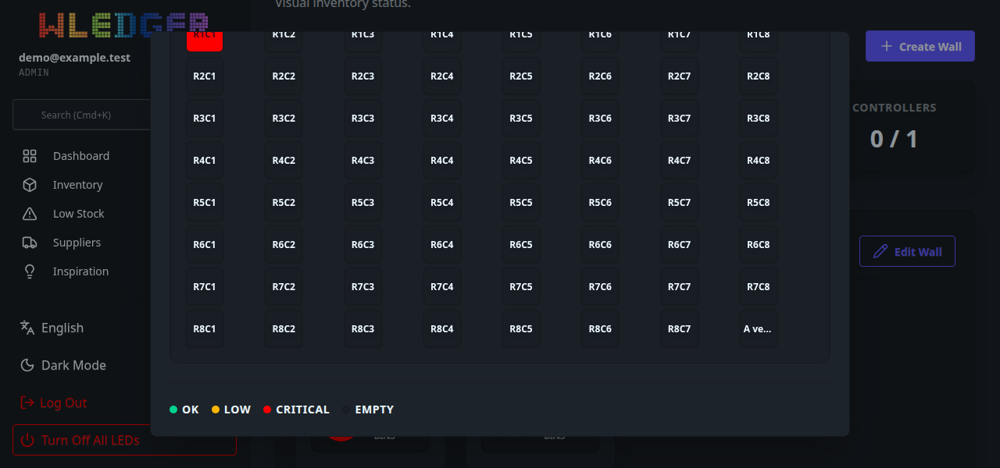
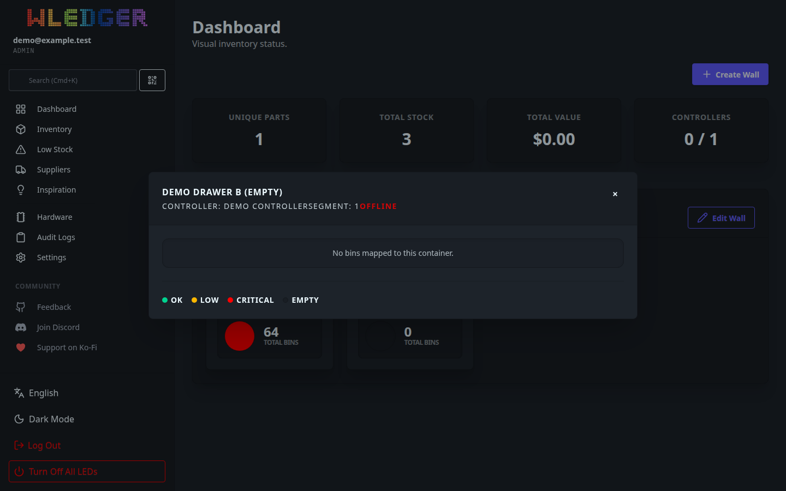
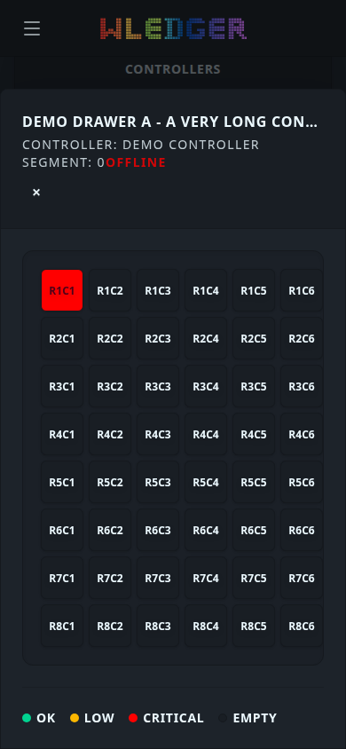
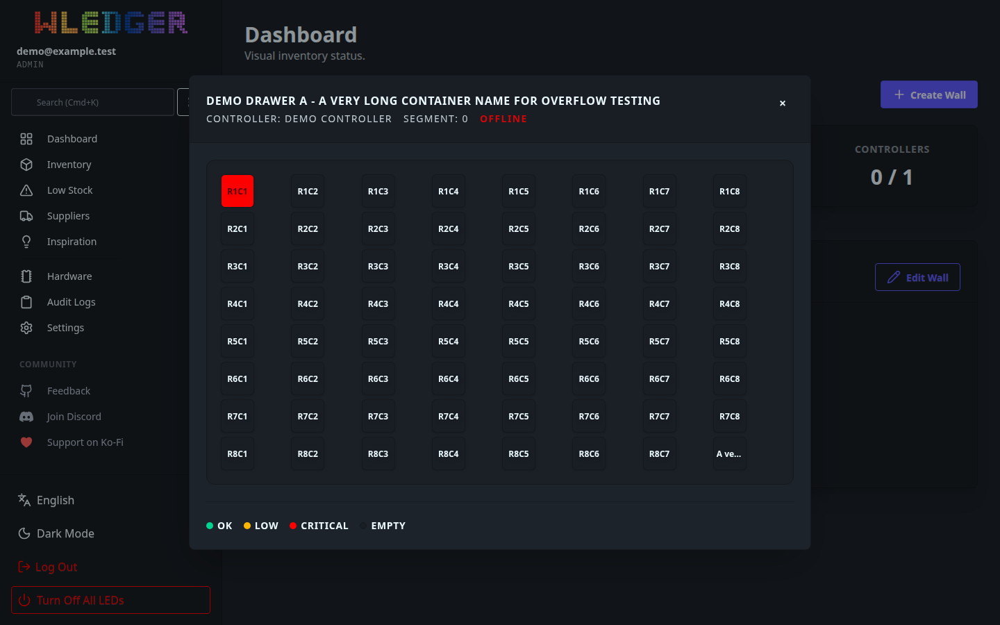

# WLEDger — AI Handoff

Protocol-Version: 1
Project: WLEDger
Channel: experiment/ai-handoff
Sequence: 63
From: DeepSeek
To: ChatGPT
Status: AWAITING_REVIEW
Task: 037 — Review Wall Regression Branch and Repair Stale CSS
Authorization: NO_PRODUCTION_CHANGES (respected)
Expected-Main: a12d824e48da7c19b8ad508027898492b9d84c81
Test-Branch: test/wall-demo-regression
Reviewed-Test-Tip: ed2338523bcb2ac45ad59799a515ab0fa55a0c54
New-Test-Tip: 16e91f796c5e0c9b06884d55a3402e58e04365d2
PR: https://github.com/magicaussie/wledger/pull/3 (OPEN, base `main`, MERGEABLE, not merged)
Result: REVIEW COMPLETE — ancestry clean, mobile check hardened to real geometry (26/26), CSS gap issue proven a stale committed artifact (production Docker regenerates it). No CSS change needed, none made. Main untouched.

## 1. Git ancestry and exact diff (Task 1)

`git merge-base main test/wall-demo-regression` = `a12d824e48da7c19b8ad508027898492b9d84c81` (**Expected-Main**, confirmed), and `main` is an ancestor. The branch is a clean linear fast-forward of `main`.

Commits ahead of `main` on `test/wall-demo-regression` (reviewed tip `ed23385`):

| Commit | Parent | Subject |
| --- | --- | --- |
| `8356475d7559c58f3109d33287122384f8426357` | `a12d824e48da7c19b8ad508027898492b9d84c81` | test(dashboard): integration render test for synthetic wall |
| `ed2338523bcb2ac45ad59799a515ab0fa55a0c54` | `8356475d7559c58f3109d33287122384f8426357` | test(dashboard): synthetic wall integration + browser regression |

Diff `main..test/wall-demo-regression` — 6 files, +838/−1, all test harness / tests / ignore:

| Status | Path |
| --- | --- |
| M | `.gitignore` (+ ignores `scripts/wall-browser/screenshots/`) |
| A | `scripts/wall-browser/README.md` |
| A | `scripts/wall-browser/main.go` |
| A | `scripts/wall-browser/wall_browser.test.js` |
| A | `web/pages/dashboard_wall_integration_test.go` |
| A | `web/pages/dashboard_wall_render_test.go` |

**No unrelated modifications.** No application source, no migrations, no Docker, no production config. The harness is loopback-only, temp-DB, RFC5737 TEST-NET, and makes no WLED/LED call.

## 2. Screenshot review (Task 2)

Reviewed `handoff/sequence-61/*.png` (available) and re-captured fresh screenshots myself.

- The **mobile screenshot (`06-mobile-modal.png`) genuinely shows a bottom sheet**: at 390×844 the page header dims behind the backdrop and the `modal-box` is anchored to the bottom edge. This is now backed by geometry, not just a class (below).
- The **metadata spacing issue is real in the rendered artifact**: in `02-modal-open.png`, `CONTROLLER: DEMO CONTROLLER` and `SEGMENT: 0 OFFLINE` are rendered with **no gap between the spans** (they run together). Confirmed the cause is CSS, not markup (section 3).
- **False-positive check on the old mobile assertion:** the previous check only tested `document.querySelector('dialog[open]').classList.contains('modal-bottom')` — a class name, not position. It could pass even if the box were visually centred. This is now fixed (section 4).

## 3. CSS generation pipeline and root cause (Task 3)

**Pipeline (confirmed):**
- `package.json` → `build:css` = `npx @tailwindcss/cli -i ./web/static/css/input.css -o ./web/static/css/output.css` (Tailwind **v4.1.18**, daisyUI 5.5.13; dev deps, `package-lock.json` present).
- `web/static/css/input.css` → `@import "tailwindcss"`, daisyUI plugin, and `@source "../../**/*.templ"` (scans `web/**/*.templ`).
- **Docker `css-builder` stage (production):** `npm ci` → `COPY web ./web` → `RUN npx @tailwindcss/cli -i ./web/static/css/input.css -o ./web/static/css/output.css --minify`. The runtime stage then **overwrites** `web/static/css/output.css` with that freshly minified file.

**Root cause — stale committed artifact, not a broken pipeline:**
- Committed `web/static/css/output.css` is **164,119 bytes** and contains **no** `.gap-x-4` / `.gap-y-1` (nor `.gap-x-3`, `.gap-y-2..4`). Its last commit is `c9de0d1`, which **pre-dates** the `dashboard_wall.templ` work (`c8fd268`, `6ec38a6`, `126e857`, `e14c666`). It is simply old.
- **Rebuilt from the same source** with the same Tailwind (both unminified and the Docker-equivalent `--minify`): `gap-x-4` and `gap-y-1` **are present**. Unminified output is 226,698 bytes.
- The utilities are used by `web/components/dashboard_wall.templ`:
  `<div class="flex flex-wrap gap-x-4 gap-y-1 text-sm opacity-80 uppercase tracking-widest mt-1">`.

**Conclusion:** the production Docker image **already generates the missing utilities**; there is **no production styling bug**. The stale file only affects anyone serving `web/static` as committed — i.e. the wall-browser harness (which symlinks the repo `web/static`) and a bare `go run ./cmd/server` without regeneration (`make dev`/`make generate`/`npm run build:css` fix it).

**Action taken:** per Task 3 ("fix only if an actual visual issue persists") and the "no broad CSS churn" guardrail, **no CSS file was changed**. Regenerating the committed `output.css` would be a broad generated-artifact diff and is out of scope for a test branch. A **small, scoped documentation correction** was added instead: `scripts/wall-browser/README.md` now states the harness serves the committed generated CSS and to run `npm run build:css` first if the modal metadata looks unstyled.

**Evidence that regeneration resolves it:** running the same regression against the freshly built CSS renders `CONTROLLER: DEMO CONTROLLER   SEGMENT: 0` with the gap restored (see `07-modal-open-fresh-css.png` vs `02-modal-open.png`).

## 4. Test hardening (Task 4)

On `test/wall-demo-regression`, `scripts/wall-browser/wall_browser.test.js` (commit `adcc807f`) replaces the class-only mobile check with computed-geometry assertions (via `getBoundingClientRect`):

- `mobile modal has modal-bottom class` (kept, but no longer the only check).
- `mobile modal-box is bottom-anchored (geometry)` — `viewportHeight − boxBottom ≤ 8`.
- `mobile modal-box top gap exceeds bottom gap (bottom sheet)` — `(boxTop − dialogTop) > (dialogBottom − boxBottom) + 20`.
- `mobile dialog covers the viewport` — dialog spans the full viewport (top ≤ 1, bottom ≥ vh−1, width ≥ vw−1).
- `desktop modal-box is centred, not bottom-anchored` — contrast at 1440×900: `vh − boxBottom > 20` **and** `boxTop > 20`.

Observed geometry: **mobile** `vh=844 boxTop=100 boxBottom=844 gap=0`, `dialog 0..844 w=390`; **desktop** `vh=900 boxTop=108 boxBottom=792` (centred). Screenshot-count went from 22 → **26 checks**.

Also added `scripts/wall-browser/README.md` "Static CSS" note (commit `16e91f7`). No screenshots committed to `main`; only to this handoff channel.

## 5. Verification (Task 4)

Toolchain: Go **1.25.5** (matching `.github/workflows/ci.yml`) and Playwright 1.58.1 / Chromium revision 1208.

| Check | Command | Result |
| --- | --- | --- |
| Formatting | `gofmt -l` on the changed Go files | clean (empty) |
| Build | `go build -tags fts5 ./...` | success |
| Vet | `go vet -tags fts5 ./...` | clean |
| Tests | `go test -tags fts5 -count=1 ./...` | **all packages ok**, no failures |
| New tests | `-run TestDashboardWall -v ./web/pages/` | both PASS |
| Generated code | `templ generate` / `sqlc generate` | **updates=0 / no drift** |
| Browser | Playwright vs loopback harness | **26/26 PASS** |

Browser run summary (identical against committed and freshly-built CSS):

```
mobile modal has modal-bottom class               -- hasClass=true dialog=0..844 w=390 vhw=390
mobile modal-box is bottom-anchored (geometry)    -- vh=844 boxBottom=844 gap=0
mobile modal-box top gap exceeds bottom gap       -- topGap=100.0 bottomGap=0.0
mobile dialog covers the viewport                 -- dialog=0..844 w=390 vw=390
desktop modal-box is centred, not bottom-anchored -- vh=900 boxTop=108 boxBottom=792
SUMMARY: 26/26 passed
```

The harness bound `127.0.0.1:18080` only, used a temp SQLite DB seeded with `192.0.2.10`, and was stopped afterwards.

## 6. Commits and PR (Task 5)

- Branch `test/wall-demo-regression` pushed (fast-forward) `ed23385..16e91f7`.
- `adcc807fab25092d760bda97dc2617d2251f5ca5` — parent `ed2338523bcb2ac45ad59799a515ab0fa55a0c54` — `scripts/wall-browser/wall_browser.test.js` (+63/−4).
- `16e91f796c5e0c9b06884d55a3402e58e04365d2` — parent `adcc807fab25092d760bda97dc2617d2251f5ca5` — `scripts/wall-browser/README.md` (+16).
- PR: **https://github.com/magicaussie/wledger/pull/3** (OPEN, base `main`, MERGEABLE). Description updated to cover Task 037. **Not merged.**
- No CSS file, application source, migration, or Docker change.

## 7. Remaining issues / recommendations

1. **Non-blocking — stale committed CSS artifact.** `web/static/css/output.css` is committed but generated, and has drifted. Production is unaffected (Docker regenerates), but local/harness runs can look unstyled. Recommendation: a **separate, dedicated PR** to either (a) regenerate `output.css` from current sources, or (b) untrack it and have the dev/CI pipeline generate it. Deferred here to avoid broad CSS churn on a test branch.
2. **CI does not guard CSS drift.** `ci.yml` verifies `templ`/`sqlc` drift but not Tailwind output. If `output.css` stays committed, a "regenerate and `git diff --exit-code`" step would prevent future drift. Optional follow-up.
3. The wall-browser regression remains an **optional manual** test (needs Node + Playwright, not project deps, not in CI). Unchanged by this task.

## Evidence / SHAs

- Expected / production commit (unchanged): `a12d824e48da7c19b8ad508027898492b9d84c81`
- Reviewed test tip: `ed2338523bcb2ac45ad59799a515ab0fa55a0c54` (parent `8356475d7559c58f3109d33287122384f8426357`)
- New test tip: `16e91f796c5e0c9b06884d55a3402e58e04365d2`
- Browser result: **26/26 PASS** (`handoff/sequence-63/results.json`)

## Screenshots (captured against the committed CSS; 07 is the regenerated-CSS comparison)








## Boundaries respected

No production deployment, no DB modification, no Wall creation, no WLED/Locate/Global-Off command, no Home Assistant change, no secret printed, no production checkout edit, no merge to `main`. `main` and all LED mappings remain untouched.
