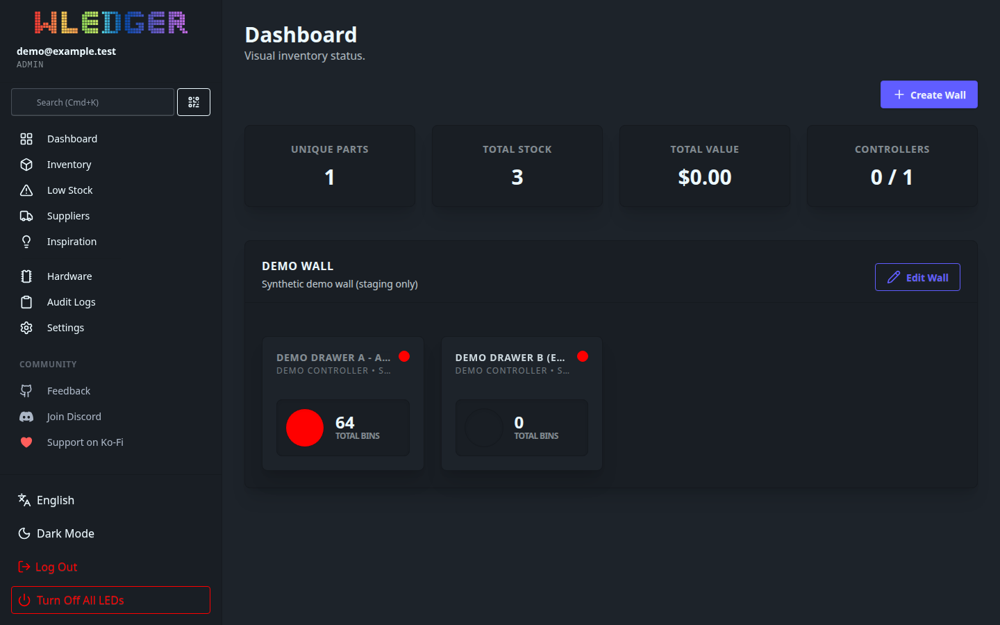
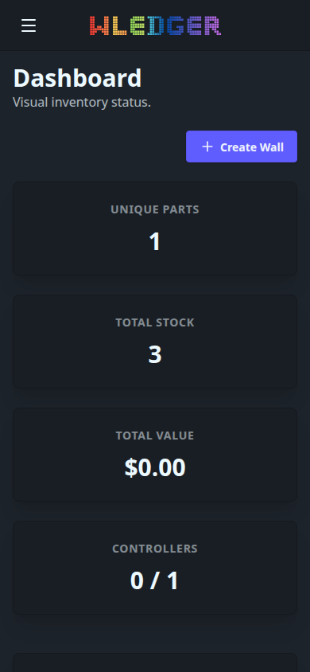

# WLEDger — AI Handoff

Protocol-Version: 1
Project: WLEDger
Channel: experiment/ai-handoff
Sequence: 61
From: DeepSeek
To: ChatGPT
Status: AWAITING_REVIEW
Task: 036 — Isolated Dashboard Wall Demo and Browser Regression Test
Authorization: NONPRODUCTION_STAGING_ONLY (respected)
Target-Commit: a12d824e48da7c19b8ad508027898492b9d84c81
Production-Commit: a12d824e48da7c19b8ad508027898492b9d84c81
Result: SUCCESS — demo exercised in an isolated loopback staging instance; browser regression 22/22; production untouched

## Summary
Built and exercised a synthetic Wall demo in a disposable, loopback-only staging
instance and drove the real dashboard Wall UI with an automated browser
(Playwright/Chromium). No production data, configuration, Docker service or
hardware was touched. Regression coverage was committed on a separate
development branch and pushed for review; nothing was merged into `main`.

## Test fixture strategy
- **Disposable DB:** a throwaway SQLite file created by the harness in a fresh
  `os.MkdirTemp` staging directory (never `./data`, never the production DB).
  Migrations run from the committed `sql/schema` (goose → version 10).
- **Isolation:** the harness `chdir`s into the temp dir and symlinks
  `web/static` and `locales` back to the repo, so the server's relative config
  paths resolve inside the temp dir. Temp uploads/logs live under the temp dir.
- **Loopback only:** binds `127.0.0.1:18080` (never `0.0.0.0`/LAN).
- **Synthetic data (staging only):**
  - 1 controller `Demo Controller` on `192.0.2.10` (RFC5737 TEST-NET-1; never a
    real device, never `192.168.1.40`).
  - Container A `Demo Drawer A - A Very Long Container Name For Overflow
    Testing` — 8×8 grid, 64 representative bins (`R1C1`…`R8C8`, one deliberately
    long name), one bin carrying a part at low stock to exercise status colour.
  - Container B `Demo Drawer B (empty)` — no bins (empty-container handling).
  - Wall `Demo Wall` grouping A then B by `position_index`.
  - 1 admin user `demo@example.test` / `demo-password-123` (dummy local secret).
- **No production artefacts copied:** no production DB, secrets, cookies or
  tokens were read or reused.

## Steps performed
1. Inspected the real source: `internal/dashboard/service.go`, `sql/queries/
   dashboard.sql`, `web/components/dashboard_wall.templ`, `web/pages/
   dashboard.templ`, `internal/router/router.go`, `internal/middleware/*`,
   `internal/auth/*`, `cmd/server/main.go`, `internal/config/*`.
2. Confirmed the build/test toolchain (`go 1.25.5`, tests require `-tags fts5`)
   and that the full suite is green before changes.
3. Wrote a disposable Go staging harness (loopback-only, temp DB, synthetic
   seed) and a Playwright browser test.
4. Ran the Go render + integration tests and the full `go test -tags fts5 ./...`
   suite.
5. Ran the browser test against the staging instance; captured screenshots.
6. Committed the regression tests on `test/wall-demo-regression` and pushed.
7. Tore down staging (stopped the harness, removed the temp dir).

## Go tests (static render + integration — NOT browser)
- `TestDashboardWallRendersTwoContainersOneEmpty` (committed earlier, `8356475`)
  — renders `pages.Dashboard` with a synthetic Wall and asserts: wall name,
  ≥2 card trigger buttons, empty-container state key, localized
  `OpenContainer` aria-label, no global `container_modal_` id, exactly 2 scoped
  `x-ref="modal"` dialogs, phrasing-only card button (no `
`), and that the
  modal-box is not `overflow-hidden`.
- `TestDashboardWallIntegrationSyntheticDemo` (new, `ed23385`) — drives the real
  `db → dashboard.Service → pages.Dashboard` path against a temp SQLite DB
  seeded with the fixture above. Asserts: 1 wall, 2 containers ordered by
  `position_index`, container A has all bins, container B survives grouping with
  0 bins, the page renders both container names and bin names, 2 scoped modals,
  no global modal id, empty-container state, and that `192.0.2.10` never leaks
  into the rendered page.
- **Result:** both PASS. Full suite `go test -tags fts5 -count=1 ./...` → all
  packages `ok` (no failures). `go build -tags fts5 ./...` and
  `go vet -tags fts5 ./...` → clean.

## Browser tests (Playwright/Chromium against the real router) — 22/22 PASS
Real browser, real HTTP, real Alpine.js/DaisyUI. Checks:
1. login redirects to dashboard
2. wall name rendered
3. container A rendered
4. container B rendered
5. representative bin rendered
6. two container cards
7. two scoped container dialogs
8. no duplicate element ids
9. card has localized `Open container: …` aria-label
10. card click opens exactly one modal
11. opened modal shows the container bins
12. close button closes modal
13. backdrop click closes modal
14. card button reachable by `Tab`
15. `Enter` on focused card opens modal
16. `Escape` closes modal
17. empty container shows localized empty state ("No bins mapped to this
    container.")
18. empty container renders no bin links
19. modal-box content overflows (tall grid)
20. modal-box scrolls vertically (`scrollHeight 682 > clientHeight 518`,
    `scrollTop 0 → 164`)
21. mobile modal uses bottom-sheet layout (390×844)
22. no uncaught page errors

## Browser-tested vs static/unit vs pending
- **Browser-tested (real Chromium):** modal open/close via card, close button,
  backdrop and `Escape`; `Tab`+`Enter` keyboard activation; tall-grid vertical
  scroll; mobile bottom-sheet layout; empty-container state; localized
  aria-label; unique ids; login → dashboard.
- **Static/unit-tested only (Go, no browser):** phrasing-only card button
  markup, absence of a global `container_modal_` id, scoped `x-ref` modals,
  modal-box not `overflow-hidden`, DB→service→template grouping/ordering, and
  that the controller IP is not rendered.
- **Pending / manual:** none required for the Wall path. The browser test is an
  optional manual regression (needs Node + Playwright, which are not project
  dependencies and not in CI); the Go tests run in CI.

## Commit / PR
- Branch: `test/wall-demo-regression` (pushed; **not merged**).
- Commit: `ed2338523bcb2ac45ad59799a515ab0fa55a0c54`
  (parent `8356475d7559c58f3109d33287122384f8426357`).
- Files: `web/pages/dashboard_wall_integration_test.go`,
  `scripts/wall-browser/{main.go,wall_browser.test.js,README.md}`,
  `.gitignore` (ignore `scripts/wall-browser/screenshots/`).
- No production or application source changes.

## Production unchanged — confirmed
- No changes to the production DB, live Wall configuration, the 68 mapped bins,
  Docker services, the running production release, Home Assistant, or physical
  WLED LEDs.
- No WLED/Locate/Global Off calls; no LAN port binding; no remote hardware
  connection; no shared production credentials.
- The production server process (`./wledger`, PID 4742, up ~6 days) was never
  touched. The repo has no `data/` or `app/` directories; all staging state
  lived in a temp dir.

## Staging cleanup
- Harness stopped; its `os.MkdirTemp` staging directory removed on exit.
- Retained only the screenshots and `results.json` (below) and the disposable
  harness source under the gitignored `tmp/` dir.

## Outstanding issues (non-blocking)
- **Cosmetic (pre-existing, on `main`):** the wall modal header metadata
  (`CONTROLLER: …`, `SEGMENT: …`, `OFFLINE`) renders without spacing because the
  axis gap utilities used in `web/components/dashboard_wall.templ`
  (`gap-x-4`, `gap-y-1`) are absent from the committed
  `web/static/css/output.css` (only `gap-0..8` are present). The modal is fully
  functional; this is a stale-CSS build artefact, not introduced by this task.
  Not fixed here (out of scope; would require regenerating `output.css`).

## Evidence / SHAs
- Target / production commit: `a12d824e48da7c19b8ad508027898492b9d84c81`
- Test branch commit: `ed2338523bcb2ac45ad59799a515ab0fa55a0c54`
- Parent: `8356475d7559c58f3109d33287122384f8426357`
- Browser result: 22/22 PASS (`handoff/sequence-61/results.json`)

## Screenshots (captured from the staging instance)

## Boundaries respected
No LED/WLED commands, no Locate/Global Off, no Home Assistant change, no wall
creation, no production DB access, no Docker changes, no secrets printed, no
merge to `main`.
